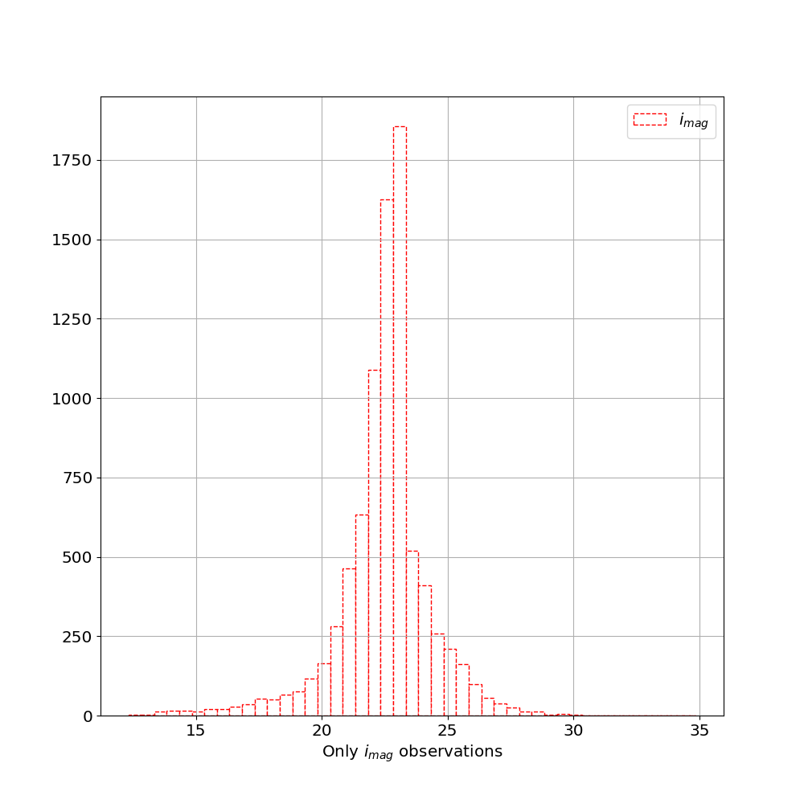
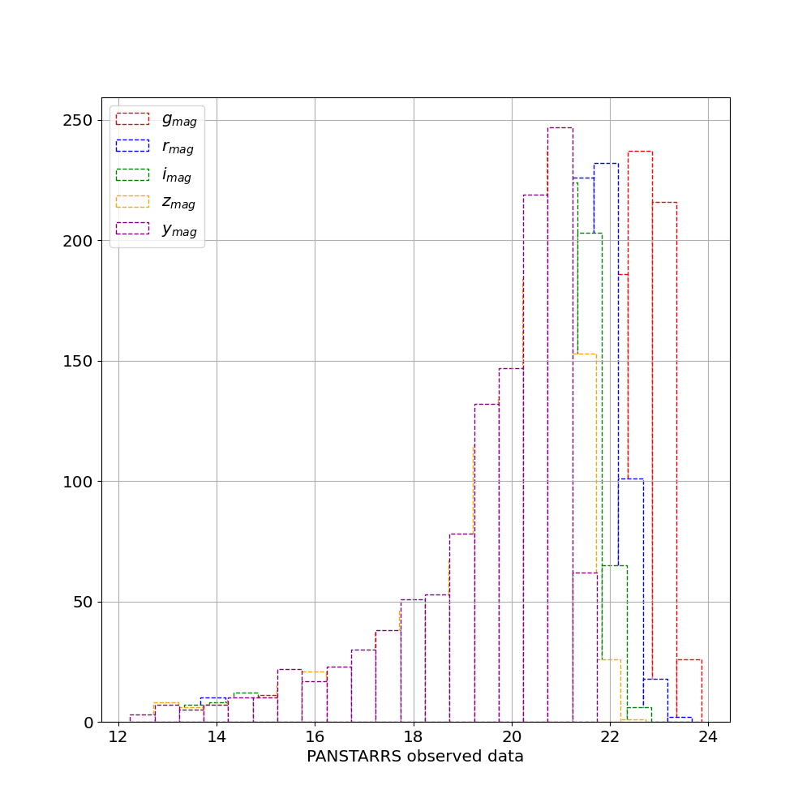
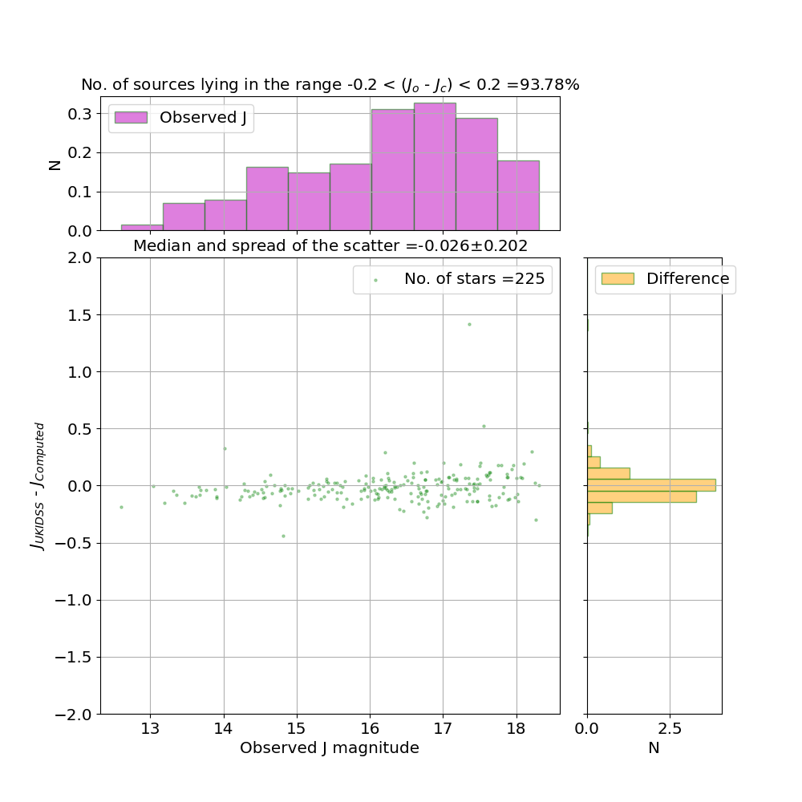

## irgsctool - tutorials

## 1. Generating IRGSC for a given set of coordinates

``` python
from irgsctool import GenerateIRGSC
gc = GenerateIRGSC(ra=0.0, dec=0.0)
gc.generate_irgsc()
```
This results in a catalog file: 'IRGSC_R_A_0_0_DEC_0_0.csv' that contains probable stellar sources in 0.25 degrees radius around the input coordinates. The following plots are also generated:
<center>
<figure>
    
    <figcaption><em><strong>Figure 1:</strong></em> The generated plot shows a color-color diagram where stars follow the magenta locus and the galaxies are randomly scattered.</figcaption>
</figure>
</center>
<center>
<figure>
    
    <figcaption><em><strong>Figure 2:</strong></em> The (psf-kron) relation of the sources plotted on the y-axis w.r.t i-psf on the x-axis. The galaxies form a random scatter while the stellar point sources are below 0.05 on the y-axis.</figcaption>
</figure>
</center>

<center>
<figure>
    
    <figcaption><em><strong>Figure 3:</strong></em> A histogram showing the depth of PANSTARRS data when only i-band observations are considered. This is sufficient depth to upto J = 22 mags in the IRGSC.</figcaption>
</figure>
</center>
<center>
<figure>
    
    <figcaption><em><strong>Figure 4:</strong></em> The figure shows the histogram of the sources that are detected in all the five filters of the PANSTARRS. The condition in the generation of IRGSC that the sources must have detection in all the filters reduces the depth of the input optical data.</figcaption>
</figure>
</center>

## 2. Validating the IRGSC
```python
from irgsctool import ValidateIRGSC
vd = ValidateIRGSC(0.0,0.0)
vd.validate(validate=True)
```
This results in the validated catalog file: 
validated_IRGSC_R_A_0_0_DEC_0_0.csv' that contains additional information about the observed NIR data and the comparison between the observed and computed NIR data. This comparison when plotted appears as shown in Figure (5,6,7).
<center>
<figure>
    
    <figcaption><em><strong>Figure 5:</strong></em> The figure shows the comparison of the computed and observed J band magnitudes.</figcaption>
</figure>
</center>
<center>
<figure>
    
    <figcaption><em><strong>Figure 6:</strong></em> The figure shows the comparison of the computed and observed J band magnitudes.</figcaption>
</figure>
</center>
<center>
<figure>
    
    <figcaption><em><strong>Figure 7:</strong></em> The figure shows the comparison of the computed and observed J band magnitudes.</figcaption>
</figure>
</center>