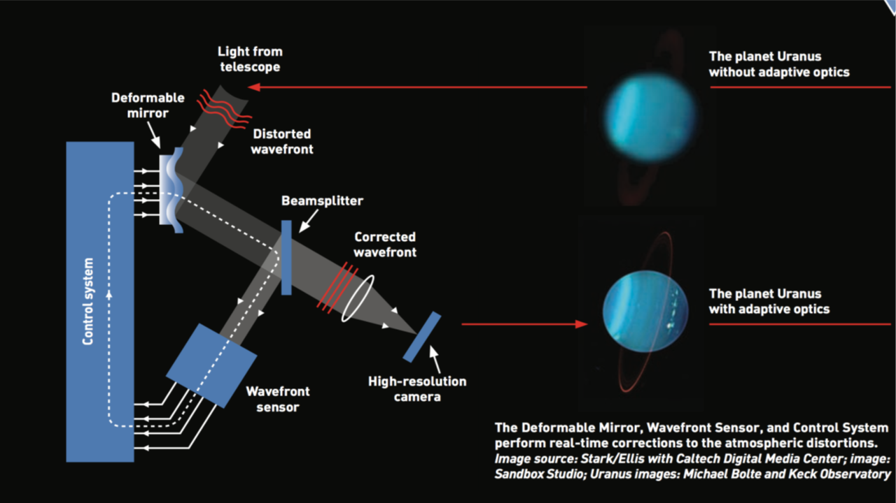

# About irgsctool
__irgsctool__ is a Python package to generate the catalog of NIR guide stars for Adaptive Optics (AO) observations of the Thirty Meter Telescope (TMT). The module computes the NIR magnitudes of the optical sources in the PANSTARRS data.
## Motivation to generate irgsctool 

The performance of any ground-based optical/near-infrared (NIR) telescope is affected by the turbulence in the atmosphere of Earth. When the light from a distant astronomical source passes through Earth's turbulent atmosphere, it distorts the wavefront of the light. These distortions make the science images appear fuzzy/blurry. To improve the performance of the ground-based optical/NIR telescopes by compensating for the effects of wavefront distortions, astronomers use a technique known as Adaptive Optics (AO). An AO system tries to correct the distortions using a WaveFront Sensor (WFS), which takes some of the astronomical light, a deformable mirror that lies in the optical path, and a computer that receives input from the detector (Refer Figure: (1)).

<figure>
    
    <figcaption><em><strong>Figure 1:</strong></em> A conceptual image of the working of an AO system.</figcaption>
</figure>

A WFS is a high-speed camera that detects the deformity in the incoming light several thousand times per second. After measuring the deformity, the WFS sends feedback to the system-controlling computer, which then changes the shape of the deformable mirror so that the light eventually becomes distortion-free. This distortion-free light is then fed to the science instruments in the telescopes to obtain high-quality images with a spatial resolution close to the theoretical diffraction limit. A science target to be studied is often too faint or extended to be used as a reference for measuring the shape of the incident wave-fronts. Instead, a nearby brighter guide star can be used for distortion correction. But, sufficiently bright stars are not available in all parts of the sky, which significantly limits the usefulness of natural guide star AO. This limitation can be overcome by creating an artificial guide star by shining a laser into the mesosphere and creating an asterism. However, much fainter natural reference stars are still required for image position or tip/tilt correction.

The Thirty Meter Telescope (TMT) is one of the largest optical and near-infrared (NIR) ground-based telescopes to be built, and the first light is expected in the next decade. The first light NIR instruments of TMT will be assisted by a multi-conjugate AO instrument, known as Narrow Field Infrared Adaptive Optics System (NFIRAOS) (see Figure: (2)). NFIRAOS will have a field of view (FOV) of 2-arcmin diameter and will use laser guide stars (LGS) for distortion correction. However, it will require three or more natural guide stars for tip/tilt correction. A catalog of guide stars will thus be a critical resource for TMT operations. It will enable efficient planning and observations, fulfilling a role similar to that of the Guide Star Catalogs I and II, which were created to allow for the acquisition and control of the Hubble Space Telescope. The TMT Infrared Guide Star Catalog (TMT-IRGSC) should be a star catalog consisting of point sources with NIR (J, H, Ks) magnitudes as faint as 22 mag in the J band in the Vega system covering the entire TMT-observable sky. No catalog currently exists with objects as faint as J_Vega = 22 mag over the entire TMT observable sky to be used as a guide star catalog. Hence it is essential to develop this catalog by computing the expected NIR magnitudes of stellar sources identified in various optical sky surveys using their optical magnitudes.

<figure>
    
    <figcaption><em><strong>Figure 2:</strong></em> A rendered image of the facility AO system on TMT - NFIRAOS.</figcaption>
</figure>

## Nature of the generated catalog
The IRGSC generated has various information about the sources shown in the following Table. This table describes the columns in the IRGSC generated for a particular test field. The details of the flags, e.g., infoflags, filterflags, and qualityflags can be found [here](https://outerspace.stsci.edu/display/PANSTARRS/PS1+StackObjectView+table+fields). These flags indicate various values assigned to
the source by the PANSTARRS team, which gives further information about the nature of the source
and the quality of its detection, which can help understand more about a particular object of interest.
It is to be noted that although this package relies on the PANSTARRS StackObjectView table, the Right
Ascension and Declination of the source is obtained from the mean photometric information as they are well calibrated using Gaia DR2.

| Column Name | Description | Data Type  |
| :----------- |:------------|:------|
| PS1_ObjID    | Source identifier in the PANSTARRS data| float |
| PS1_ra       | Right Ascencion of the source in the PANSTARRS DR2 weighted mean photometry| float|
| PS1_ra_error | Uncertainty in PS1_ra| float|
| PS1_dec      | Declination of the source in the PANSTARRS DR2 weighted mean photometry| float|
| PS1_dec_error| Uncertainty in the PS1_dec| float|
| PS1_gpsf     | psf magnitude of the source in the g-band stacked photometry | float|
| PS1_gpsf     | Uncertainty in PS1_gpsf|
| PS1_rpsf     | psf magnitude of the source in the r-band stacked photometry | float|
| PS1_rpsf     | Uncertainty in PS1_rpsf | float|
| PS1_ipsf     | psf magnitude of the source in the i-band stacked photometry | float|
| PS1_ipsf     | Uncertainty in PS1_ipsf | float|
| PS1_zpsf     | psf magnitude of the source in the z-band stacked photometry | float|
| PS1_zpsf     | Uncertainty in PS1_zpsf | float|
| PS1_ypsf     | psf magnitude of the source in the y-band stacked photometry | float|
| PS1_ypsf     | Uncertainty in PS1_ypsf | float|
| SAM_Name     | Name of the best-fitted Stellar Atmospheric Model (SAM)| string|
| Teff         | Best-fitted model parameter: Teff| float|
| logg         | Best-fitted model parameter: log(g)| float|
| [Fe/H]       | Best-fitted model parameter: [Fe/H]| float|
|sam_g         | Best-fitted model magnitudes in PANSTARRS g-filter| float|
|sam_r         | Best-fitted model magnitudes in PANSTARRS r-filter| float|
|sam_i         | Best-fitted model magnitudes in PANSTARRS i-filter| float|
|sam_z         | Best-fitted model magnitudes in PANSTARRS z-filter| float|
|sam_y         | Best-fitted model magnitudes in PANSTARRS y-filter| float|
|sam_j         | Best-fitted model magnitudes in PANSTARRS j-filter| float|
|sam_h         | Best-fitted model magnitudes in PANSTARRS h-filter| float|
|sam_k         | Best-fitted model magnitudes in PANSTARRS k-filter| float|
| scale factor | The scale factor computed after fitting the SAM| float|
| scale factor error| Error in the computed scale factor| float|
| d_dev        | The parameter denoting the goodness-of-fit| float|
| Computed J   | The computed J magnitude in the Vega system| float|
| Computed J error| Error in computed J magnitude| float|
| Computed H   | The computed H magnitude in the Vega system| float|
| Computed H error| Error in computed H magnitude| float|
| Computed K   | The computed K magnitude in the Vega system| float|
| Computed K error| Error in computed K magnitude| float|
| gaia source id| Source identifier in Gaia DR3| float|
| gaia ra | Right Ascension of the source in Gaia DR3 catalog| float|
| gaia ra error| Uncertainty in gaia ra| float|
| gaia dec | Declination of the source in Gaia DR3 catalog| float|
| gaia dec error | Uncertainty in gaia dec | float|
| gaia parallax| Parallax (mas) of the source in the Gaia DR3 catalog| float|
| gaia parallax error| Uncertainty in gaia parallax| float|
| gaia pm| pm of the source (mas/yr) in Gaia DR3 catalog| float|
| gaia pm ra| pm of the source along R.A. axis in the Gaia DR3 catalog| float|
| gaia pm ra error| Uncertainty gaia pm ra | float|
| gaia pm dec| pm of the source along Dec. axis in the Gaia DR3 catalog| float|
| gaia pm dec error| Uncertainty gaia pm dec | float|
| gaia ruwe| Renormalised Unit Weight Error flag of the source in Gaia DR3| float|
| objinfoflag | These flag values of the source in PANSTARRS data specify whether the object is a QSO, transient, asteroid, extended, a known solar system object, etc. in nature| float|
| objqualityflag | These flag values denote if an object is real or a possible false positive | float|
| ndetections |The number of times something is detected from the individual exposures| float|
| nstackdetections | The number of stack detections after which the stack photometric measurements are done | float|
| ginfoflag | These flags indicate the details of the g filter stack photometry | float|
| ginfoflag2 | These flags indicate the details of the g filter stack photometry | float|
| ginfoflag3 | These flags indicate the details of the g filter stack photometry | float|
| rinfoflag | These flags indicate the details of the r filter stack photometry | float|
| rinfoflag2 | These flags indicate the details of the r filter stack photometry | float|
| rinfoflag3 | These flags indicate the details of the r filter stack photometry | float|
| iinfoflag | These flags indicate the details of the i filter stack photometry | float|
| iinfoflag2 | These flags indicate the details of the i filter stack photometry | float|
| iinfoflag3 | These flags indicate the details of the i filter stack photometry | float|
| zinfoflag | These flags indicate the details of the z filter stack photometry | float|
| zinfoflag2 | These flags indicate the details of the z filter stack photometry | float|
| zinfoflag3 | These flags indicate the details of the z filter stack photometry | float|
| yinfoflag | These flags indicate the details of the y filter stack photometry | float|
| yinfoflag2 | These flags indicate the details of the y filter stack photometry | float|
| yinfoflag3 | These flags indicate the details of the y filter stack photometry | float|

## Application of irgsctool on fields
The method developed for the generation of IRGSC has applied on twenty test fields across the sky. The generaed IRGSC is also valiated using the UKIDSS data available for those fields and the generated as well as validated catalog for these fields can be found in the [generated_irgsc](https://github.com/sshah1502/irgsc/tree/main/generated_irgsc) directory.
In addition to the twenty test fields, additional ten catalogs are provided for the PANSTARRS Medium Deep Survey (MDS) Fields [more information available here](https://arxiv.org/abs/1612.05560). Out of eleven MDS fields, one field coincides with M31. Hence it is skipped here since the MDS data is not publically released by the PANSTARRS, the optical data to generate the IRGSC for these fields is been taken from the 3-pi PANSTARRS survey.
In case of validation using the UKIDSS observed NIR data, certain fields have observations in only one or two out of the J, H and K bands. This package takes care of these issues and validates the generated IRGSC using the available band data.