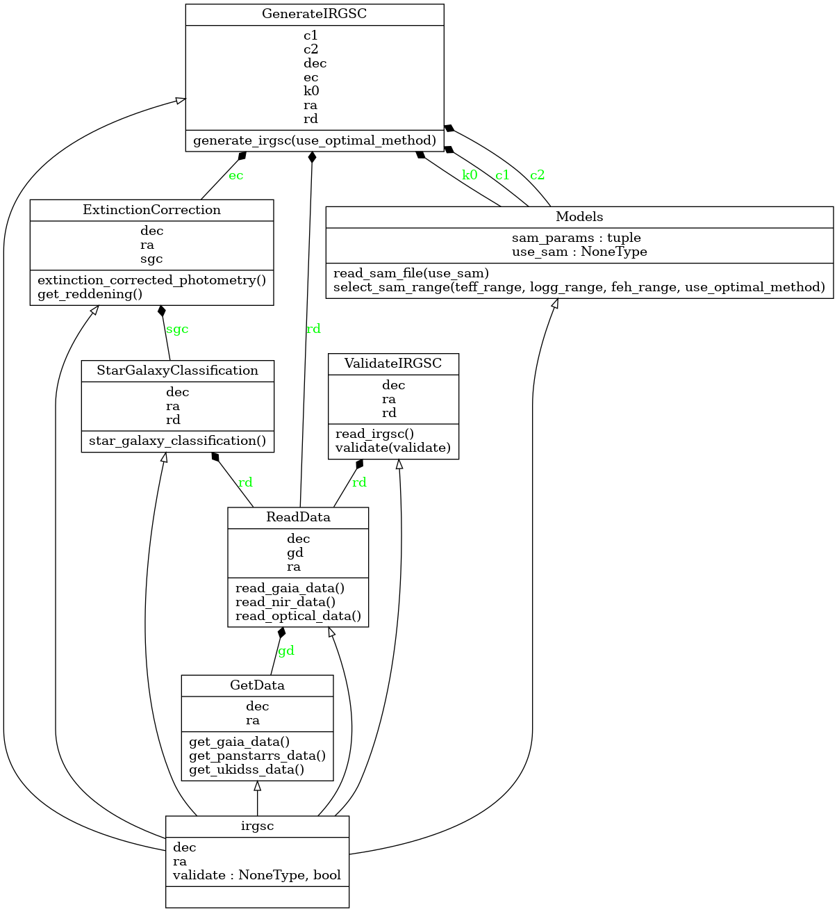

# API Reference

This page introduces to the classes and functions in the ***irgsctool*** package. The main class is the ***irgsc*** class which has several subclasses like [GetData](/irgsc/apireference/#irgsctool._get_data.GetData), [ReadData](/irgsc/apireference/#irgsctool._read_data.ReadData), [StarGalaxyClassification](/irgsc/apireference/#irgsctool._sgc.StarGalaxyClassification), [ExtinctionCorrection](/irgsc/apireference/#irgsctool._extinction_correction.ExtinctionCorrection), [GenerateIRGSC](/irgsc/apireference/#irgsctool._fitting.GenerateIRGSC), [ValidateIRGSC](/irgsc/apireference/#irgsctool._validate.ValidateIRGSC).

Figure (1) shows the UML diagram of the irgsctool package.

<figure>
    
    <figcaption><em><strong>Figure 1:</strong></em> The UML diagram of the <em><strong> irgsctool </em></strong> package.</figcaption>
</figure>

::: irgsctool

::: irgsctool._get_data

::: irgsctool._read_data

::: irgsctool._sgc

::: irgsctool._extinction_correction

::: irgsctool._sam

::: irgsctool._fitting

::: irgsctool._validate